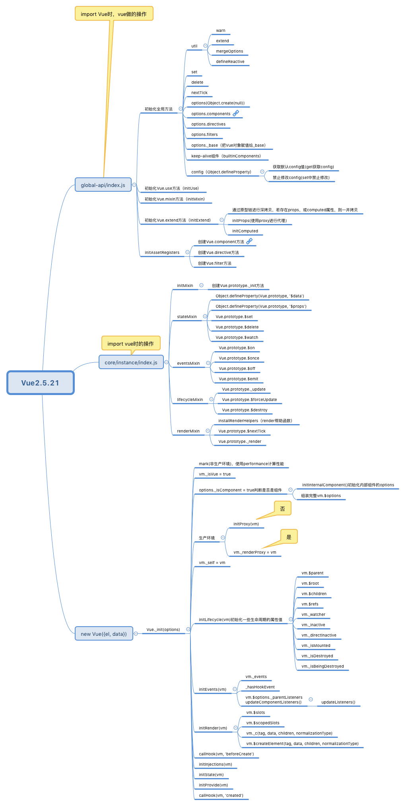

### Vue 2.5.21源码



当Vue加载到页面时，做了些什么呢。
```js
// /src/core/index.js
initGlobalAPI(Vue)
```
initGlobalAPI主要是初始化一些全局方法：
- Vue.util.warn（输出警告）
- Vue.util.extend（浅拷贝）
- Vue.util.mergeOptions（合并options）
- Vue.util.defineReactive（初始化监听器）
- Vue.set
- Vue.delete
- Vue.nextTick

初始化options中的一些操作：
- options.components
- options.directives
- options.filters
- options._base

使用Object.defineProperty挂载config，config配置文件/src/core/config.js.


```js
// /src/core/instance/index.js
initMixin(Vue)
stateMixin(Vue)
eventsMixin(Vue)
lifecycleMixin(Vue)
renderMixin(Vue)
```